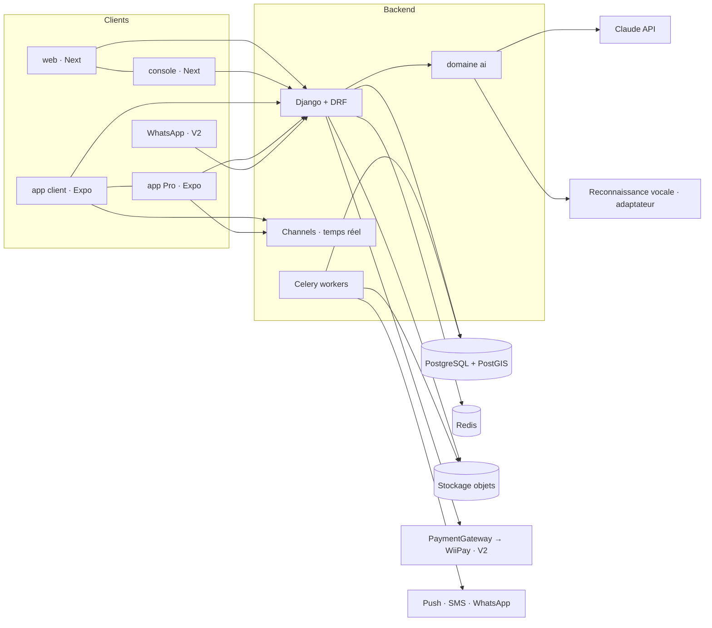
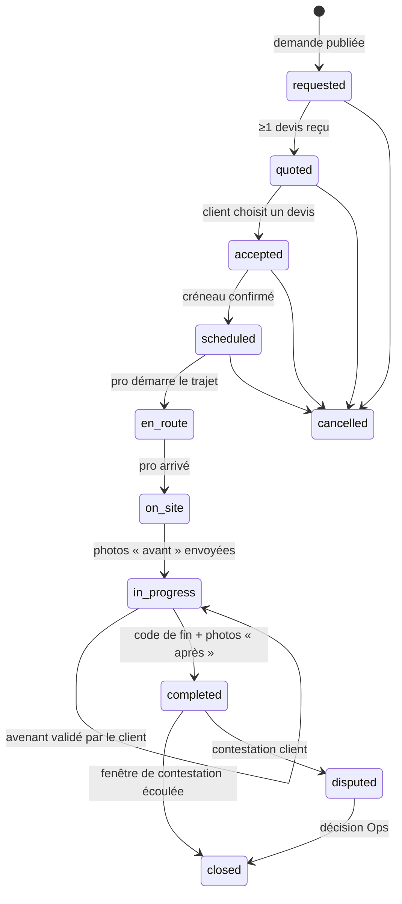

# Jeflink — Architecture

## Vue d'ensemble



## Domaines backend

| Domaine         | Responsabilité                                                                                                                                                                 |
| --------------- | ------------------------------------------------------------------------------------------------------------------------------------------------------------------------------ |
| `accounts`      | Utilisateurs, OTP, rôles (client, owner, technician, ops), sessions                                                                                                            |
| `zones`         | Polygones de quartiers (puis villes), disponibilité des métiers par zone                                                                                                       |
| `catalog`       | Métiers, services, fourchettes de prix de référence. Métiers = lignes en base (slug stable, libellés `fr`/`wo`, actif oui/non), jamais un `enum` ou des `choices` dans le code |
| `providers`     | Profils pro, équipes, disponibilités, badges, Passeport Pro                                                                                                                    |
| `requests`      | Demandes clients (texte/voix/photos), devis, sélection                                                                                                                         |
| `bookings`      | Réservation, machine à états, avenants, code de fin, preuves                                                                                                                   |
| `payments`      | Interface `PaymentGateway`, intentions, webhooks                                                                                                                               |
| `wallet`        | Grand livre en partie double, soldes dérivés, versements                                                                                                                       |
| `reviews`       | Avis multicritères, modération                                                                                                                                                 |
| `messaging`     | Conversations, pièces jointes, masquage des numéros avant réservation                                                                                                          |
| `notifications` | Push, SMS, WhatsApp, préférences, replis                                                                                                                                       |
| `trust`         | KYC, litiges, garantie, signalements, `AuditEvent`                                                                                                                             |
| `promotions`    | Codes promo, parrainage                                                                                                                                                        |
| `analytics`     | Événements produit, demandes non servies                                                                                                                                       |
| `ai`            | Fournisseurs, prompts versionnés, schémas, évals, journal de coûts                                                                                                             |

## Machine à états d'une réservation



Règles : chaque transition passe par `bookings.services.transition()`, vérifie l'acteur autorisé, écrit un `BookingEvent` et publie un événement temps réel. Les annulations tardives portent un motif et alimentent la fiabilité du pro ou du client.

## Argent

- Grand livre en partie double (`wallet.LedgerEntry`) : chaque mouvement = au moins deux écritures équilibrées. Les soldes sont dérivés, jamais stockés comme source de vérité.
- Comptes types : `client_escrow`, `pro_available`, `pro_pending`, `pro_commission_due`, `platform_revenue`.
- Paiement cash : écriture `pro_commission_due` à la clôture. Paiement en ligne (V2) : fonds en `pro_pending` jusqu'à `closed`, commission prélevée, reste en `pro_available`.
- `PaymentGateway` : `create_intent`, `confirm`, `refund`, `payout`, `verify_webhook`. Adaptateurs : `cash`, `manual_mobile_money` (V1), `wiipay` (V2), `fake` (tests).

## Couche IA (`apps/api/jeflink/ai`)

```
ai/
  providers/     anthropic.py, fake.py          # client LLM derrière une interface
  speech/        base.py, <adaptateur>.py       # reconnaissance vocale, à benchmarker
  prompts/       structure_request/v1.md ...    # prompts versionnés, jamais en dur
  schemas.py     # sorties Pydantic validées
  services.py    # structure_request, price_range, draft_quote, summarize_dispute...
  evals/         # jeux de cas réels anonymisés + scripts de score
  models.py      # AIRun : capacité, version de prompt, latence, coût, résultat, validé ou non
```

- Modèles configurés par variables d'environnement (`AI_MODEL_DEFAULT`, `AI_MODEL_FAST`), jamais en dur dans le code.
- Chaque capacité a : un schéma de sortie, un seuil de confiance, un repli sans IA, un jeu d'évaluation, un feature flag.
- Données envoyées au modèle minimisées (pas de numéro, pas de nom complet, pas de pièce d'identité).

## Temps réel et notifications

- Channels + Redis : chat, statut de réservation, position « en route ».
- Notification critique : push → SMS si non lu après N minutes → WhatsApp (V2).

## Auth

- OTP téléphone → JWT (access court + refresh rotatif) pour le mobile.
- Console et web : BFF Next, tokens en cookies httpOnly.
- Permissions Ops granulaires (`ops.kyc.review`, `ops.dispute.decide`, `ops.wallet.adjust`…).

## Environnements

`local` (docker-compose) · `staging` · `production`. Observabilité : Sentry (api + fronts + apps), logs JSON structurés sans données personnelles.
