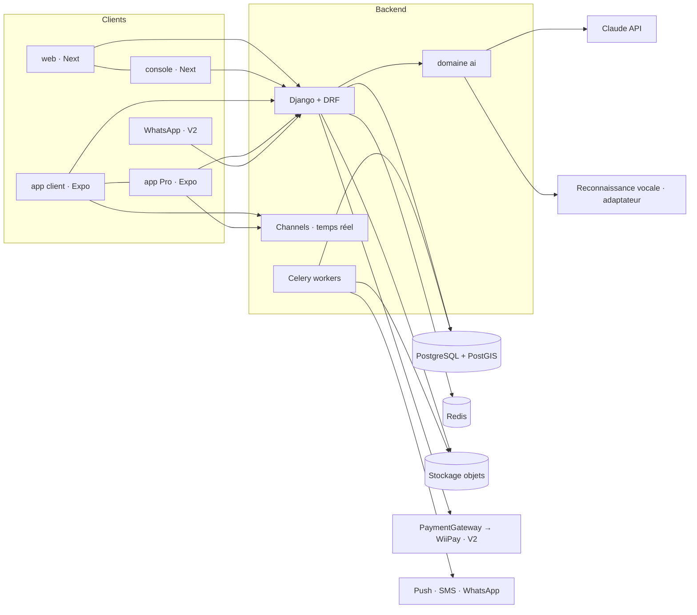
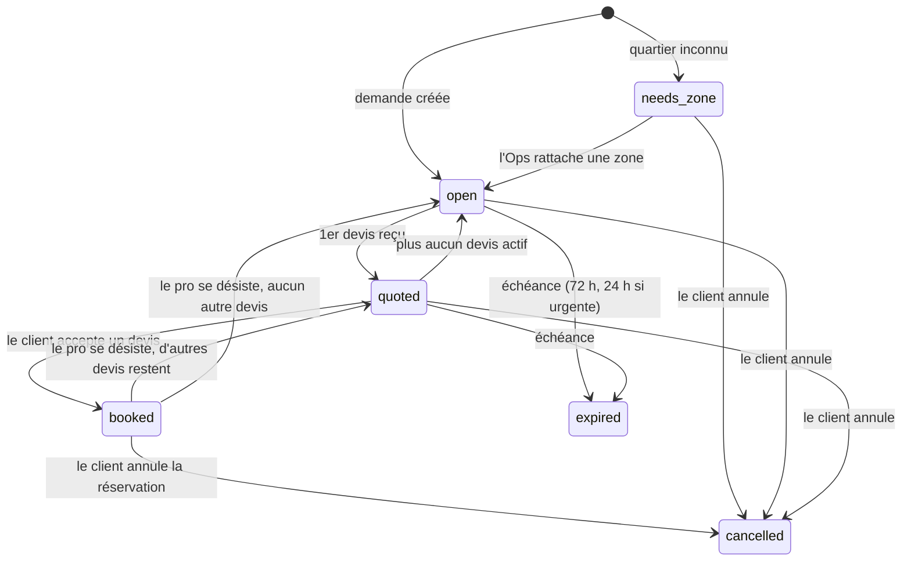
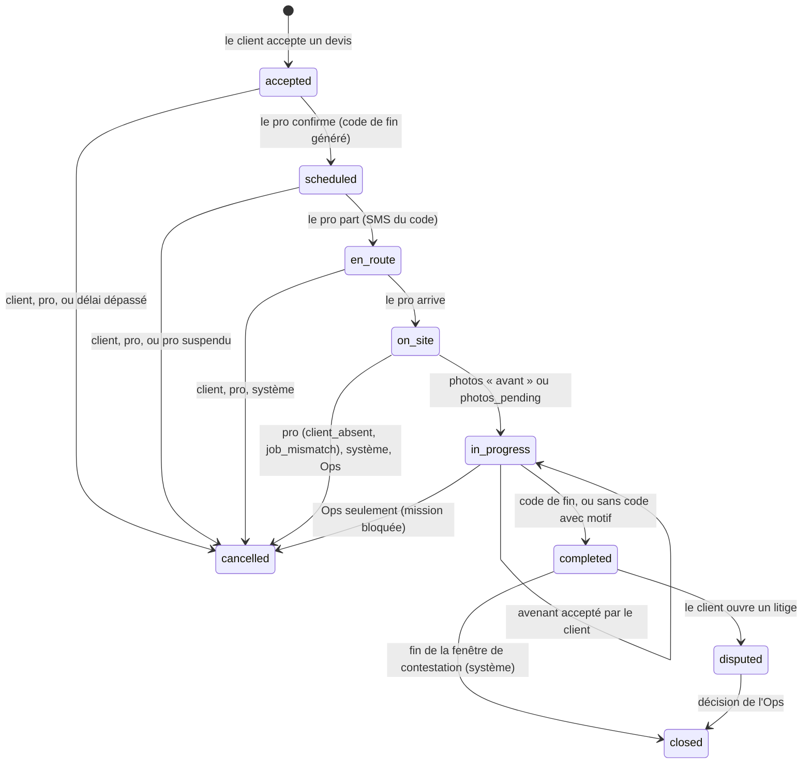

# Jeflink — Architecture

## Vue d'ensemble



## Domaines backend

| Domaine         | Responsabilité                                                                                                                                                                              |
| --------------- | ------------------------------------------------------------------------------------------------------------------------------------------------------------------------------------------- |
| `accounts`      | Comptes par téléphone, OTP SMS, sessions d'appareil (JWT + refresh rotatif), rôles et invitations, second facteur Ops, changement de numéro, suppression et anonymisation, purge (spec 001) |
| `zones`         | Quartiers (centre + rayon, contour optionnel), villes, disponibilité des métiers par zone                                                                                                   |
| `catalog`       | Métiers, services, fourchettes de prix de référence. Métiers = lignes en base (slug stable, libellés `fr`/`wo`, actif oui/non), jamais un `enum` ou des `choices` dans le code              |
| `providers`     | Fiche pro (statut `pending`, `verified`, `suspended`, métiers, zones), création et vérification par l'Ops (spec 003) ; équipes, disponibilités, badges, Passeport Pro plus tard             |
| `requests`      | Demande (cycle `needs_zone` à `expired`), devis (3 au plus, prix ferme ou visite), diffusion aux pros éligibles ; photos et voix plus tard (spec 003, ADR 0010)                             |
| `bookings`      | Réservation née à `accepted`, machine à états déclarée en entier, `BookingEvent`, confirmation du pro ; avenants, code de fin, preuves à l'étape 4 (spec 003, ADR 0010)                     |
| `payments`      | `PaymentGateway` et adaptateurs, canaux de règlement, intentions de paiement (déclaration, décision de l'Ops), API du portefeuille pro (spec 005)                                           |
| `wallet`        | Grand livre en partie double immuable, soldes dérivés, taux et commission à la clôture, seuils de dette, ajustements de la Comptabilité (spec 005, ADR 0012)                                |
| `reviews`       | Avis (note, puces, commentaire facultatif), publication à la clôture, moyenne, modération                                                                                                   |
| `messaging`     | Conversations, pièces jointes, masquage des numéros avant réservation                                                                                                                       |
| `notifications` | `notify(kind, recipients, ref)` après commit (adaptateur `log` en local/test) ; push, SMS (`SmsGateway`, adaptateur `fake` en local/test seulement), WhatsApp, préférences, replis          |
| `trust`         | KYC, litiges, garantie, signalements, `AuditEvent`                                                                                                                                          |
| `promotions`    | Codes promo, parrainage                                                                                                                                                                     |
| `analytics`     | `UnservedDemand` (demandes non servies, sans identifiant d'utilisateur) ; autres événements produit plus tard                                                                               |
| `ai`            | Fournisseurs, prompts versionnés, schémas, évals, journal de coûts                                                                                                                          |

## Demande, devis et réservation : deux cycles de vie

Référence : spec `docs/specs/003-requests-quotes-booking.md`, ADR 0010. Le client décrit son besoin (la **demande**), au plus 3 pros vérifiés envoient un **devis**, le client en accepte un : la **réservation** naît alors à `accepted`. Avant ce choix, il n'y a ni pro, ni montant, ni créneau : la demande porte son propre cycle, et seule `requests.services` en change le statut (table de transitions testée couple par couple).

### Cycle de vie d'une demande (`requests.ServiceRequest`)



Les durées et limites sont des réglages (`settings`), jamais en dur : expiration de la demande, validité d'un devis, 3 devis actifs par demande, 10 devis en attente par pro, 3 demandes non closes et 10 créations par jour et par client, délai de confirmation du pro. Le temps passé en `needs_zone` ne compte pas dans l'échéance.

### Machine à états d'une réservation (`bookings.Booking`)



Spec 004 : **tous les couples sont activés**. Un couple interdit lève `transition_not_allowed` ; le mécanisme `transition_not_enabled` reste pour un futur couple déclaré mais inactif. `scheduled`, `en_route` ou `on_site` peuvent finir en `cancelled` ; le client ne peut pas annuler un pro déjà sur place. Une intervention commencée (`on_site`, `in_progress`) ne se débloque que par l'Ops (action « Annuler la mission », groupe `Médiation`, motif et audit) ; la tâche `flag_stuck` la signale 12 h après `slot_end` (réglage `BOOKING_STUCK_AFTER`, filtre « bloquée » de l'admin). « En route » et « Arrivé » sont refusés avant le début du créneau moins 2 h (`BOOKING_EARLY_START_MARGIN`, `409 too_early`).

Règles :

- Chaque transition passe par `bookings.services.transition()`, qui verrouille la ligne, vérifie le couple et l'acteur (`client`, `pro`, `system`, `ops`), écrit le statut et un `BookingEvent` immuable. Un test d'architecture interdit toute écriture de `status` hors de `bookings/services.py`.
- **Confirmation du pro** : 4 h (1 h si urgente), délai gelé de 21 h à 7 h (heure de `Africa/Dakar`) et borné par le début du créneau (`machine.confirm_deadline`, fonction pure). Sans confirmation, la tâche `bookings.tasks.cancel_unconfirmed` annule (`pro_unconfirmed`, poids de fiabilité 0), rend les autres devis au client et exclut le pro de la demande.
- **Fiabilité (trace seulement)** : un désistement du pro après `scheduled` pèse 1, et 2 s'il a lieu à moins de 2 h du créneau (`late`) ; rien avant `scheduled`. Le client n'est jamais pénalisé (une annulation tardive est tracée).
- **Divulgation** : le repère, la position et le numéro du client (vers le pro), le numéro du pro (vers le client) ne sont renvoyés qu'à partir de `scheduled` (`machine.DISCLOSED_STATUSES`), jamais après une annulation. Avant, les numéros saisis dans une description ou un message de devis sont masqués à l'affichage (`common.pii.mask_numbers`) ; ce masquage n'est pas étanche et un compteur par pro (`Provider.masked_numbers_count`) aide l'Ops à repérer les abus.
- **Ordre des verrous** : comptes (par id), fiche pro, demande, réservation. Deux acceptations simultanées donnent une seule réservation.
- **Argent** : le client règle le pro (mention fixe : à régler au pro) ; aucun mouvement avant la clôture. À la clôture, la commission s'écrit au grand livre (voir « Argent »).
- **Notifications** : `notifications.events.notify(kind, recipients, ref)`, appelé après commit, ne transporte que des `public_id` (`request.new`, `quote.received`, `booking.to_confirm`, `booking.scheduled`, `booking.cancelled`, puis, spec 004 : `completion_code.sms`, `amendment.proposed`, `booking.dispute_reminder` (SMS), `booking.progress`, `amendment.decided`, `booking.completed`, `booking.no_show_check`, `no_show.contested`, `booking.disputed`, `dispute.decided`, `booking.closed`). Le futur adaptateur SMS rend le gabarit (code, prix) côté serveur à partir de la référence. Push et SMS : étape 6.

### Déroulé, fin de mission, litige et avis (spec 004)

- **Code de fin** : 4 chiffres tirés à `scheduled`, chiffrés (MultiFernet, `DATA_ENCRYPTION_KEYS`), comparés en temps constant, effacés à `completed` ou `cancelled`. Visible du client seul ; jamais dans une réponse au pro, un log ni un audit. Cinq codes faux le verrouillent, trois régénérations, un SMS automatique au départ du pro et deux sur demande. Repli `no_code` (`client_absent`, `client_no_phone`, `code_locked`, `client_refuses` avec photo « après » obligatoire) : fenêtre de contestation de 72 h au lieu de 48 h.
- **Photos** (`BookingPhoto`, ADR 0011) : envoi multipart par le gérant, réencodé en WebP sans EXIF ni GPS dans la requête, miniature par tâche Celery, URL signées de 10 min, signalement par le client (masquée pour les deux, gardée pour l'Ops en cas de litige), purge 12 mois après la clôture. Repère et position de la demande vidés 90 jours après la clôture.
- **Avenant** (`Amendment`) : le pro propose le nouveau prix complet (3 au plus, un seul en attente) ; seul le client, depuis sa session, le fait changer : `accept_amendment` est le seul endroit où `Booking.amount_xof` change après la création (test d'architecture). Aucun mouvement d'argent.
- **No-show** (`NoShowReport`) : déclaré par le client après `slot_end` + 60 min, la réservation est annulée et la demande rouverte tout de suite ; le poids de fiabilité 3 n'est journalisé qu'après 24 h sans contestation du pro, ou sur décision de l'Ops (groupe `Médiation`).
- **Clôture** : `close_due` (beat, 5 min) clôt à `dispute_deadline` ; `bookings.services.register_close_handler(fn)` appelle `fn(booking, reason)` dans la transaction de toute arrivée à `closed`. `reviews` y publie les avis ; `wallet` y écrit la commission (spec 005).
- **Litige** (`trust.Dispute`) : `bookings.services` appelle `trust.services`, jamais l'inverse. L'Ops tranche dans l'admin (`resolve_dispute`, aucun remboursement en V1) ; `for_client` journalise un poids de 2 et rouvre l'avis 7 jours.
- **Avis** (`reviews.Review`) : une note suffit, publié à la clôture, moyenne (`rating_for_providers`) à partir de 3 avis publiés, hors masqués, comptes de revue et pros de démo ; modération (`Modération avis`) sans suppression.

## Argent

Référence : spec `docs/specs/005-wallet-commission.md`, ADR 0012 (précise l'ADR 0002). En V1, Jeflink ne détient aucun fonds de client : le client paie le pro (espèces ou mobile money), et la commission devient une dette du pro, qu'il règle en mobile money ou au bureau.

### Grand livre (`wallet`)

- **Deux tables** : `LedgerTransaction` (en-tête : type, clé d'idempotence unique, pro, réservation ou intention liée, contre-passation, motif, acteur) et `LedgerEntry` (compte, côté `debit` ou `credit`, `amount_xof` strictement positif). Au moins deux lignes, débits égaux aux crédits. Pas de montant signé.
- **Garanties en base** : triggers d'immuabilité sur les deux tables (et sur `CommissionRate` et `Commission`) ; trigger de contrainte différé qui refuse au commit une transaction déséquilibrée ou à une seule ligne, même écrite en SQL brut. `post_transaction` force la vérification avant de rendre la main. Une réécriture à l'identique est permise (rechargement des données de test).
- **Un seul écrivain** : `wallet.services.post_transaction()` ; les modèles du grand livre ne sont importés que dans `wallet` (tests d'architecture). Montants `int` vérifiés (jamais `bool`, `float` ni `Decimal`), aucune division réelle ni `float` dans `wallet` et `payments`, aucun champ `balance` dans aucun modèle.
- **Soldes dérivés** à la lecture (`wallet.selectors`) : `provider_wallet(provider)` rend dû, avoir, en attente, dette effective et état (`ok`, `alert`, `blocked`).

| Compte                                          | Propriétaire          | Rôle                                                         |
| ----------------------------------------------- | --------------------- | ------------------------------------------------------------ |
| `pro_commission_due`                            | un pro                | Créance de Jeflink sur le pro (négatif : avoir)              |
| `platform_revenue`                              | Jeflink               | Commissions acquises                                         |
| `platform_collections`                          | Jeflink, un par canal | Fonds reçus, à rapprocher du relevé du canal                 |
| `platform_goodwill`                             | Jeflink               | Gestes commerciaux                                           |
| `client_escrow`, `pro_pending`, `pro_available` | (V2)                  | Déclarés, aucune écriture permise en V1 (`post_transaction`) |

| Mouvement                  | Débit                                                                              | Crédit               |
| -------------------------- | ---------------------------------------------------------------------------------- | -------------------- |
| Commission à la clôture    | `pro_commission_due`                                                               | `platform_revenue`   |
| Règlement confirmé         | `platform_collections[c]`                                                          | `pro_commission_due` |
| Geste commercial           | `platform_goodwill`                                                                | `pro_commission_due` |
| Correction (dette oubliée) | `pro_commission_due`                                                               | `platform_revenue`   |
| Contre-passation, avoir    | forme inverse de la transaction annulée (partielle permise, plafonnée sous verrou) |

### Commission

- **Taux** (`CommissionRate`) : en ajout seul, par défaut ou par métier, en points de base, plafond par mission, date d'effet jamais dans le passé. Le taux en vigueur à l'envoi du devis s'applique (`rate_for`). Lancement : 10 % plafonné à 20 000 F, 7 % pour la climatisation, l'électroménager et la plomberie (`seed_reference_data`).
- **À la clôture** : `charge_commission_on_close`, inscrit par `register_close_handler`, écrit une `Commission` par réservation (assiette = montant à la clôture, avenants compris ; `commission_xof` arrondit à l'entier inférieur). Due pour toute fin (code ou `no_code`) et toute décision de litige ; exemptée sans écriture pour un compte de revue, un taux de 0, un montant arrondi à 0 ou un taux manquant (alerte). Idempotente ; ne bloque jamais une clôture.
- **Seuils** (réglages `WALLET_DEBT_ALERT_XOF`, `WALLET_DEBT_BLOCK_XOF`) sur la dette effective : alerte, puis nouveaux devis refusés (`409 commission_debt_over_limit`, garde inscrite par `requests.quotes.register_quote_guard`). Rien d'autre n'est bloqué. Une déclaration compte comme payée tant que l'Ops n'a pas décidé, sauf après un rejet « introuvable » ou « doublon » non suivi d'une confirmation. `remind_debts` relance une fois par semaine.

### Règlements (`payments`)

- **`PaymentGateway`** (`create_intent`, `confirm`, `refund`, `payout`, `verify_webhook`), registre `get_gateway(name)`. Adaptateurs : `manual_mobile_money` et `cash` (V1 ; remboursement, versement et webhook non offerts), `fake` (local et test seulement, refusé au démarrage, à l'appel et en base), `wiipay` (V2). Une passerelle n'écrit jamais en base.
- **Canaux** (`SettlementChannel`) : données saisies par la Comptabilité (Wave, Orange Money, caisse…), slug et passerelle figés, jamais supprimés.
- **`PaymentIntent`** : déclaré par le pro (`Idempotency-Key`, référence unique par canal tant que l'intention vit, 4 derniers chiffres si payé d'un autre numéro) ou saisi par l'Ops (relevé, espèces). Statuts : `declared`, `needs_correction` (une fois), `confirmed`, `rejected`, `cancelled`. Confirmé, il s'écrit au grand livre (`wallet.record_settlement`). `payments` appelle `wallet`, jamais l'inverse ; `wallet` lit les déclarations en attente par un registre (`register_pending_source`).
- **Admin** : `Rapprochement` décide et saisit les règlements, `Comptabilité` gère taux et canaux et passe avoirs, gestes, corrections et contre-passations. Toute écriture d'argent exige un code TOTP saisi depuis moins de 5 minutes (`accounts.admin_site.StepUpForm`), jamais sur son propre compte pro, auditée.
- **API pro** : `/api/pro/wallet/…` (résumé, historique, déclarations), vues dans `payments`. La référence ne sort qu'en 4 derniers caractères, les chiffres du payeur jamais.

### Ordre des verrous (prolongé)

Comptes utilisateurs (par id), fiche pro, demande, réservation, intention de paiement, comptes du grand livre du pro (par id). Les comptes de la plateforme ne sont jamais verrouillés.

## Couche IA (`apps/api/jeflink/ai`)

```
ai/
  providers/     anthropic.py, fake.py          # client LLM derrière une interface
  speech/        base.py, <adaptateur>.py       # reconnaissance vocale, à benchmarker
  prompts/       structure_request/v1.md ...    # prompts versionnés, jamais en dur
  schemas.py     # sorties Pydantic validées
  services.py    # structure_request, price_range, draft_quote, summarize_dispute...
  evals/         # jeux de cas réels anonymisés + scripts de score
  models.py      # AIRun : capacité, version de prompt, latence, coût, résultat, validé ou non
```

- Modèles configurés par variables d'environnement (`AI_MODEL_DEFAULT`, `AI_MODEL_FAST`), jamais en dur dans le code.
- Chaque capacité a : un schéma de sortie, un seuil de confiance, un repli sans IA, un jeu d'évaluation, un feature flag.
- Données envoyées au modèle minimisées (pas de numéro, pas de nom complet, pas de pièce d'identité).

## Temps réel et notifications

- Channels + Redis : chat, statut de réservation, position « en route ».
- Notification critique : push → SMS si non lu après N minutes → WhatsApp (V2).

## Auth

Référence : spec `docs/specs/001-accounts.md`, ADR 0007 (sessions, BFF) et 0008 (SMS).

- **Connexion par code SMS** (`otp/request`, `otp/verify`) : le téléphone est l'identifiant, le compte n'est créé qu'après le code. Réponses identiques que le compte existe ou non. Limites par numéro, appareil, IP, préfixe et plafond global ; jamais d'ouverture si Redis tombe.
- **Sessions** : une `DeviceSession` par appareil ; access JWT court (HS256, `kid` en rotation), refresh opaque tourné à chaque usage avec une grâce unique de 24 h ; réutilisation détectée → session révoquée. Aucun rôle dans le jeton : les rôles sont relus en base. Bearer seul côté API (ni session Django, ni CSRF, ni CORS).
- **Web et console** : BFF Next, jetons en cookies `HttpOnly` ; le navigateur n'en voit jamais.
- **Compte dormant** : plus de 60 j sans activité et nouvel appareil → session restreinte (numéro peut-être recyclé). « Repartir de zéro » ou levée par l'Ops.
- **Ops** : second facteur TOTP obligatoire sur la console (enrôlement par jeton hors bande), TOTP de moins de 5 min pour les actions `manage` (step-up). Permissions par groupe (`HasOpsPerm("ops.<domaine>.<action>", step_up=…)`), jamais par `is_superuser`. Quotas par Ops sur la recherche et la révélation des numéros.
- **Admin Django** : équipe technique seulement, hôte interne, second facteur TOTP et limite de débit. Lecture seule, sauf la saisie du catalogue et des zones (groupe `Saisie catalogue`, spec 002) : ajout et modification, jamais de suppression ni de changement de slug.

## Règles transverses posées par `accounts`

- **Audit** : toute action sensible écrit un `AuditEvent` via `trust.services.audit()`, avec un schéma de métadonnées déclaré (`register_audit_schema`) ; numéros seulement masqués ou en HMAC ; audit hors transaction (`durable=True`) sur un chemin d'erreur.
- **Suppression du compte** : anonymisation, la ligne reste. Chaque domaine qui stocke des données personnelles enregistre un anonymiseur (`register_anonymizer`) ; un domaine peut refuser la suppression (`register_deletion_blocker`) **à condition de créer ses objets bloquants sous le verrou du compte**.
- **Compte de revue des stores** (`User.is_review_account`) : ses données ne sont jamais diffusées aux vrais pros.
- **Rétention** : purge quotidienne (`accounts.tasks.purge_auth_data`), durées en réglages (`AUTH_RETENTION`).

## Environnements

`local` (docker-compose) · `staging` · `production`. Observabilité : Sentry (api + fronts + apps), logs JSON structurés sans données personnelles.
