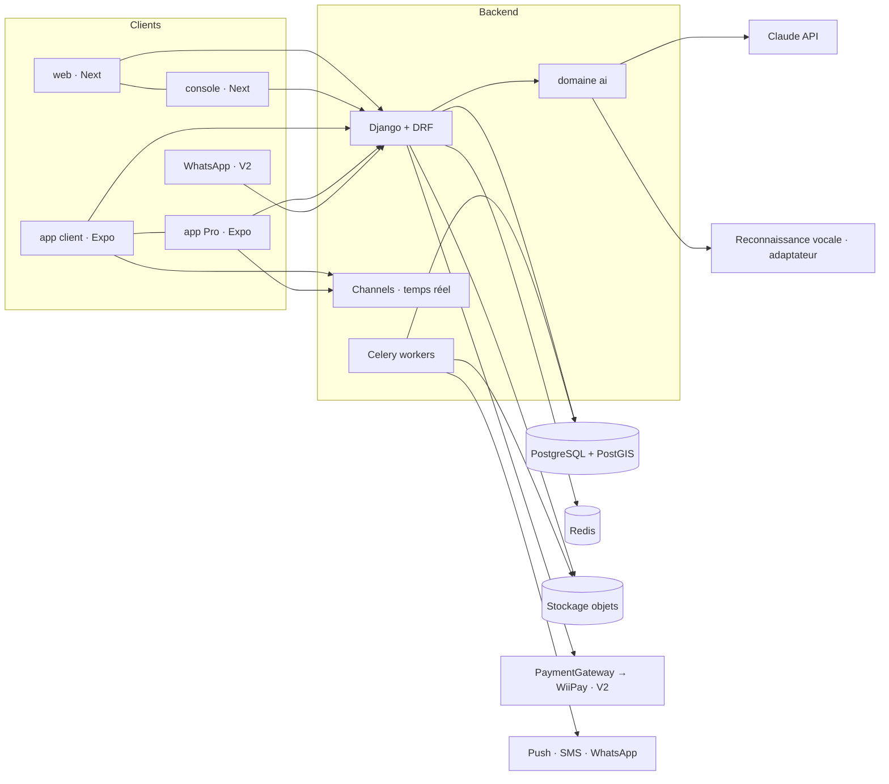
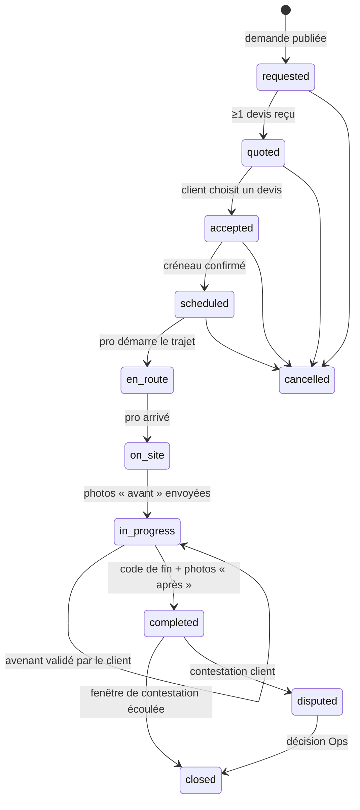

# Jeflink — Architecture

## Vue d'ensemble



## Domaines backend

| Domaine         | Responsabilité                                                                                                                                                                              |
| --------------- | ------------------------------------------------------------------------------------------------------------------------------------------------------------------------------------------- |
| `accounts`      | Comptes par téléphone, OTP SMS, sessions d'appareil (JWT + refresh rotatif), rôles et invitations, second facteur Ops, changement de numéro, suppression et anonymisation, purge (spec 001) |
| `zones`         | Polygones de quartiers (puis villes), disponibilité des métiers par zone                                                                                                                    |
| `catalog`       | Métiers, services, fourchettes de prix de référence. Métiers = lignes en base (slug stable, libellés `fr`/`wo`, actif oui/non), jamais un `enum` ou des `choices` dans le code              |
| `providers`     | Profils pro, équipes, disponibilités, badges, Passeport Pro                                                                                                                                 |
| `requests`      | Demandes clients (texte/voix/photos), devis, sélection                                                                                                                                      |
| `bookings`      | Réservation, machine à états, avenants, code de fin, preuves                                                                                                                                |
| `payments`      | Interface `PaymentGateway`, intentions, webhooks                                                                                                                                            |
| `wallet`        | Grand livre en partie double, soldes dérivés, versements                                                                                                                                    |
| `reviews`       | Avis multicritères, modération                                                                                                                                                              |
| `messaging`     | Conversations, pièces jointes, masquage des numéros avant réservation                                                                                                                       |
| `notifications` | Push, SMS (`SmsGateway`, adaptateur `fake` en local/test seulement), WhatsApp, préférences, replis                                                                                          |
| `trust`         | KYC, litiges, garantie, signalements, `AuditEvent`                                                                                                                                          |
| `promotions`    | Codes promo, parrainage                                                                                                                                                                     |
| `analytics`     | Événements produit, demandes non servies                                                                                                                                                    |
| `ai`            | Fournisseurs, prompts versionnés, schémas, évals, journal de coûts                                                                                                                          |

## Machine à états d'une réservation



Règles : chaque transition passe par `bookings.services.transition()`, vérifie l'acteur autorisé, écrit un `BookingEvent` et publie un événement temps réel. Les annulations tardives portent un motif et alimentent la fiabilité du pro ou du client.

## Argent

- Grand livre en partie double (`wallet.LedgerEntry`) : chaque mouvement = au moins deux écritures équilibrées. Les soldes sont dérivés, jamais stockés comme source de vérité.
- Comptes types : `client_escrow`, `pro_available`, `pro_pending`, `pro_commission_due`, `platform_revenue`.
- Paiement cash : écriture `pro_commission_due` à la clôture. Paiement en ligne (V2) : fonds en `pro_pending` jusqu'à `closed`, commission prélevée, reste en `pro_available`.
- `PaymentGateway` : `create_intent`, `confirm`, `refund`, `payout`, `verify_webhook`. Adaptateurs : `cash`, `manual_mobile_money` (V1), `wiipay` (V2), `fake` (tests).

## Couche IA (`apps/api/jeflink/ai`)

```
ai/
  providers/     anthropic.py, fake.py          # client LLM derrière une interface
  speech/        base.py, <adaptateur>.py       # reconnaissance vocale, à benchmarker
  prompts/       structure_request/v1.md ...    # prompts versionnés, jamais en dur
  schemas.py     # sorties Pydantic validées
  services.py    # structure_request, price_range, draft_quote, summarize_dispute...
  evals/         # jeux de cas réels anonymisés + scripts de score
  models.py      # AIRun : capacité, version de prompt, latence, coût, résultat, validé ou non
```

- Modèles configurés par variables d'environnement (`AI_MODEL_DEFAULT`, `AI_MODEL_FAST`), jamais en dur dans le code.
- Chaque capacité a : un schéma de sortie, un seuil de confiance, un repli sans IA, un jeu d'évaluation, un feature flag.
- Données envoyées au modèle minimisées (pas de numéro, pas de nom complet, pas de pièce d'identité).

## Temps réel et notifications

- Channels + Redis : chat, statut de réservation, position « en route ».
- Notification critique : push → SMS si non lu après N minutes → WhatsApp (V2).

## Auth

Référence : spec `docs/specs/001-accounts.md`, ADR 0007 (sessions, BFF) et 0008 (SMS).

- **Connexion par code SMS** (`otp/request`, `otp/verify`) : le téléphone est l'identifiant, le compte n'est créé qu'après le code. Réponses identiques que le compte existe ou non. Limites par numéro, appareil, IP, préfixe et plafond global ; jamais d'ouverture si Redis tombe.
- **Sessions** : une `DeviceSession` par appareil ; access JWT court (HS256, `kid` en rotation), refresh opaque tourné à chaque usage avec une grâce unique de 24 h ; réutilisation détectée → session révoquée. Aucun rôle dans le jeton : les rôles sont relus en base. Bearer seul côté API (ni session Django, ni CSRF, ni CORS).
- **Web et console** : BFF Next, jetons en cookies `HttpOnly` ; le navigateur n'en voit jamais.
- **Compte dormant** : plus de 60 j sans activité et nouvel appareil → session restreinte (numéro peut-être recyclé). « Repartir de zéro » ou levée par l'Ops.
- **Ops** : second facteur TOTP obligatoire sur la console (enrôlement par jeton hors bande), TOTP de moins de 5 min pour les actions `manage` (step-up). Permissions par groupe (`HasOpsPerm("ops.<domaine>.<action>", step_up=…)`), jamais par `is_superuser`. Quotas par Ops sur la recherche et la révélation des numéros.
- **Admin Django** : équipe technique seulement, en lecture seule, hôte interne, second facteur TOTP et limite de débit.

## Règles transverses posées par `accounts`

- **Audit** : toute action sensible écrit un `AuditEvent` via `trust.services.audit()`, avec un schéma de métadonnées déclaré (`register_audit_schema`) ; numéros seulement masqués ou en HMAC ; audit hors transaction (`durable=True`) sur un chemin d'erreur.
- **Suppression du compte** : anonymisation, la ligne reste. Chaque domaine qui stocke des données personnelles enregistre un anonymiseur (`register_anonymizer`) ; un domaine peut refuser la suppression (`register_deletion_blocker`) **à condition de créer ses objets bloquants sous le verrou du compte**.
- **Compte de revue des stores** (`User.is_review_account`) : ses données ne sont jamais diffusées aux vrais pros.
- **Rétention** : purge quotidienne (`accounts.tasks.purge_auth_data`), durées en réglages (`AUTH_RETENTION`).

## Environnements

`local` (docker-compose) · `staging` · `production`. Observabilité : Sentry (api + fronts + apps), logs JSON structurés sans données personnelles.
